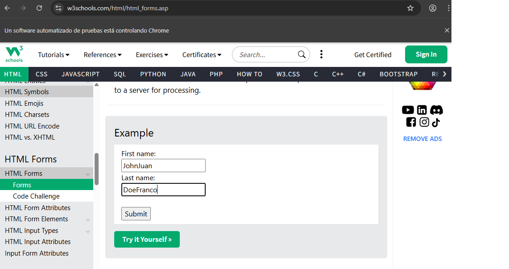
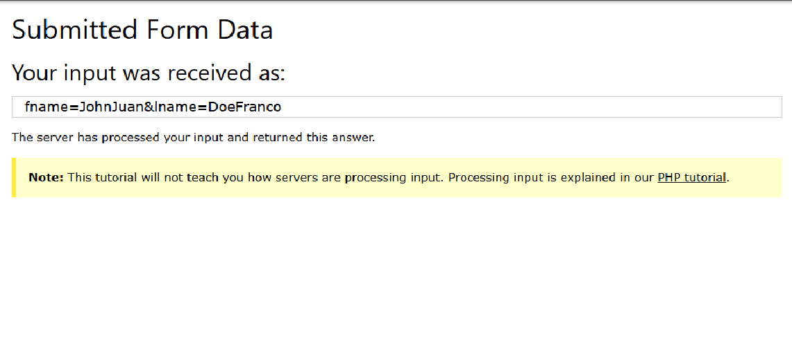

# Bot de Formularios con Selenium

Este proyecto abre un navegador Chrome, llena un formulario de ejemplo y simula el envío.

## Instalación
1. Clona el repositorio.
2. Instala dependencias:
## Ejemplo visual

Formulario llenado automatico:

Resultado del envio:
